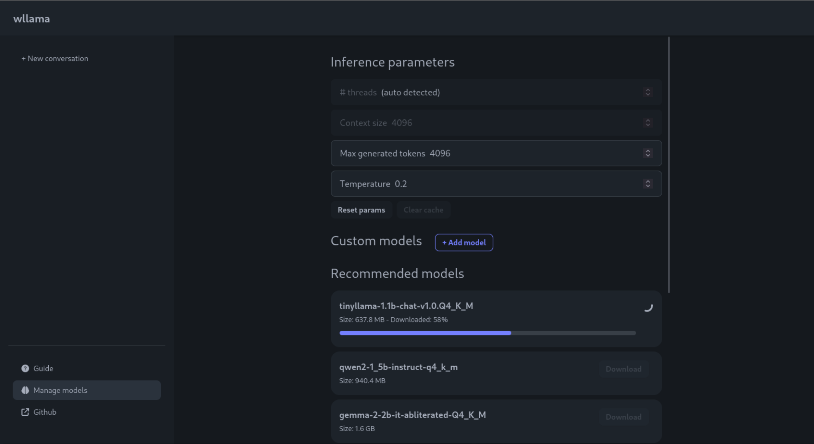

# wllama - Wasm binding for llama.cpp


WebAssembly binding for [llama.cpp](https://github.com/ggerganov/llama.cpp)

👉 [Try the demo app](https://huggingface.co/spaces/ngxson/wllama)

📄 [Documentation](https://github.ngxson.com/wllama/docs/)

For changelog, please visit [releases page](https://github.com/ngxson/wllama/releases)

> [!IMPORTANT]  
> Version 2.0 is released 👉 [read more](./guides/intro-v2.md)



## Features

- Typescript support
- Can run inference directly on browser (using [WebAssembly SIMD](https://emscripten.org/docs/porting/simd.html)), no backend or GPU is needed!
- No runtime dependency (see [package.json](./package.json))
- High-level API: completions, embeddings
- Low-level API: (de)tokenize, KV cache control, sampling control,...
- Ability to split the model into smaller files and load them in parallel (same as `split` and `cat`)
- Auto switch between single-thread and multi-thread build based on browser support
- Inference is done inside a worker, does not block UI render
- Pre-built npm package [@wllama/wllama](https://www.npmjs.com/package/@wllama/wllama)

Limitations:
- To enable multi-thread, you must add `Cross-Origin-Embedder-Policy` and `Cross-Origin-Opener-Policy` headers. See [this discussion](https://github.com/ffmpegwasm/ffmpeg.wasm/issues/106#issuecomment-913450724) for more details.
- No WebGPU support, but maybe possible in the future
- Max file size is 2GB, due to [size restriction of ArrayBuffer](https://stackoverflow.com/questions/17823225/do-arraybuffers-have-a-maximum-length). If your model is bigger than 2GB, please follow the **Split model** section below.

## Code demo and documentation

📄 [Documentation](https://github.ngxson.com/wllama/docs/)

Demo:
- Basic usages with completions and embeddings: https://github.ngxson.com/wllama/examples/basic/
- Embedding and cosine distance: https://github.ngxson.com/wllama/examples/embeddings/
- For more advanced example using low-level API, have a look at test file: [wllama.test.ts](./src/wllama.test.ts)

## How to use

### Use Wllama inside React Typescript project

Install it:

```bash
npm i @wllama/wllama
```

Then, import the module:

```ts
import { Wllama } from '@wllama/wllama';
let wllamaInstance = new Wllama(WLLAMA_CONFIG_PATHS, ...);
// (the rest is the same with earlier example)
```

For complete code example, see [examples/main/src/utils/wllama.context.tsx](./examples/main/src/utils/wllama.context.tsx)

NOTE: this example only covers completions usage. For embeddings, please see [examples/embeddings/index.html](./examples/embeddings/index.html)

### Prepare your model

- It is recommended to split the model into **chunks of maximum 512MB**. This will result in slightly faster download speed (because multiple splits can be downloaded in parallel), and also prevent some out-of-memory issues.  
  See the "Split model" section below for more details.
- It is recommended to use quantized Q4, Q5 or Q6 for balance among performance, file size and quality. Using IQ (with imatrix) is **not** recommended, may result in slow inference and low quality.

### Simple usage with ES6 module

For complete code, see [examples/basic/index.html](./examples/basic/index.html)

```javascript
import { Wllama } from './esm/index.js';

(async () => {
  const CONFIG_PATHS = {
    'single-thread/wllama.wasm': './esm/single-thread/wllama.wasm',
    'multi-thread/wllama.wasm' : './esm/multi-thread/wllama.wasm',
  };
  // Automatically switch between single-thread and multi-thread version based on browser support
  // If you want to enforce single-thread, add { "n_threads": 1 } to LoadModelConfig
  const wllama = new Wllama(CONFIG_PATHS);
  // Define a function for tracking the model download progress
  const progressCallback =  ({ loaded, total }) => {
    // Calculate the progress as a percentage
    const progressPercentage = Math.round((loaded / total) * 100);
    // Log the progress in a user-friendly format
    console.log(`Downloading... ${progressPercentage}%`);
  };
  // Load GGUF from Hugging Face hub
  // (alternatively, you can use loadModelFromUrl if the model is not from HF hub)
  await wllama.loadModelFromHF(
    'ggml-org/models',
    'tinyllamas/stories260K.gguf',
    {
      progressCallback,
    }
  );
  const outputText = await wllama.createCompletion(elemInput.value, {
    nPredict: 50,
    sampling: {
      temp: 0.5,
      top_k: 40,
      top_p: 0.9,
    },
  });
  console.log(outputText);
})();
```

Alternatively, you can use the `*.wasm` files from CDN:

```js
import WasmFromCDN from '@wllama/wllama/esm/wasm-from-cdn.js';
const wllama = new Wllama(WasmFromCDN);
// NOTE: this is not recommended, only use when you can't embed wasm files in your project
```

### Split model

Cases where we want to split the model:
- Due to [size restriction of ArrayBuffer](https://stackoverflow.com/questions/17823225/do-arraybuffers-have-a-maximum-length), the size limitation of a file is 2GB. If your model is bigger than 2GB, you can split the model into small files.
- Even with a small model, splitting into chunks allows the browser to download multiple chunks in parallel, thus making the download process a bit faster.

We use `llama-gguf-split` to split a big gguf file into smaller files. You can download the pre-built binary via [llama.cpp release page](https://github.com/ggerganov/llama.cpp/releases):

```bash
# Split the model into chunks of 512 Megabytes
./llama-gguf-split --split-max-size 512M ./my_model.gguf ./my_model
```

This will output files ending with `-00001-of-00003.gguf`, `-00002-of-00003.gguf`, and so on.

You can then pass to `loadModelFromUrl` or `loadModelFromHF` the URL of the first file and it will automatically load all the chunks:

```js
const wllama = new Wllama(CONFIG_PATHS, {
  parallelDownloads: 5, // optional: maximum files to download in parallel (default: 3)
});
await wllama.loadModelFromHF(
  'ngxson/tinyllama_split_test',
  'stories15M-q8_0-00001-of-00003.gguf'
);
```

### Custom logger (suppress debug messages)

When initializing Wllama, you can pass a custom logger to Wllama.

Example 1: Suppress debug message

```js
import { Wllama, LoggerWithoutDebug } from '@wllama/wllama';

const wllama = new Wllama(pathConfig, {
  // LoggerWithoutDebug is predefined inside wllama
  logger: LoggerWithoutDebug,
});
```

Example 2: Add emoji prefix to log messages

```js
const wllama = new Wllama(pathConfig, {
  logger: {
    debug: (...args) => console.debug('🔧', ...args),
    log: (...args) => console.log('ℹ️', ...args),
    warn: (...args) => console.warn('⚠️', ...args),
    error: (...args) => console.error('☠️', ...args),
  },
});
```

## How to compile the binary yourself

This repository already come with pre-built binary from llama.cpp source code. However, in some cases you may want to compile it yourself:
- You don't trust the pre-built one.
- You want to try out latest - bleeding-edge changes from upstream llama.cpp source code.

You can use the commands below to compile it yourself:

```shell
# /!\ IMPORTANT: Require having docker compose installed

# Clone the repository with submodule
git clone --recurse-submodules https://github.com/ngxson/wllama.git
cd wllama

# Optionally, you can run this command to update llama.cpp to latest upstream version (bleeding-edge, use with your own risk!)
# git submodule update --remote --merge

# Install the required modules
npm i

# Firstly, build llama.cpp into wasm
npm run build:wasm
# Then, build ES module
npm run build
```

## TODO

- Add support for LoRA adapter
- Support GPU inference via WebGL
- Support multi-sequences: knowing the resource limitation when using WASM, I don't think having multi-sequences is a good idea
- Multi-modal: Waiting for refactoring LLaVA implementation from llama.cpp
